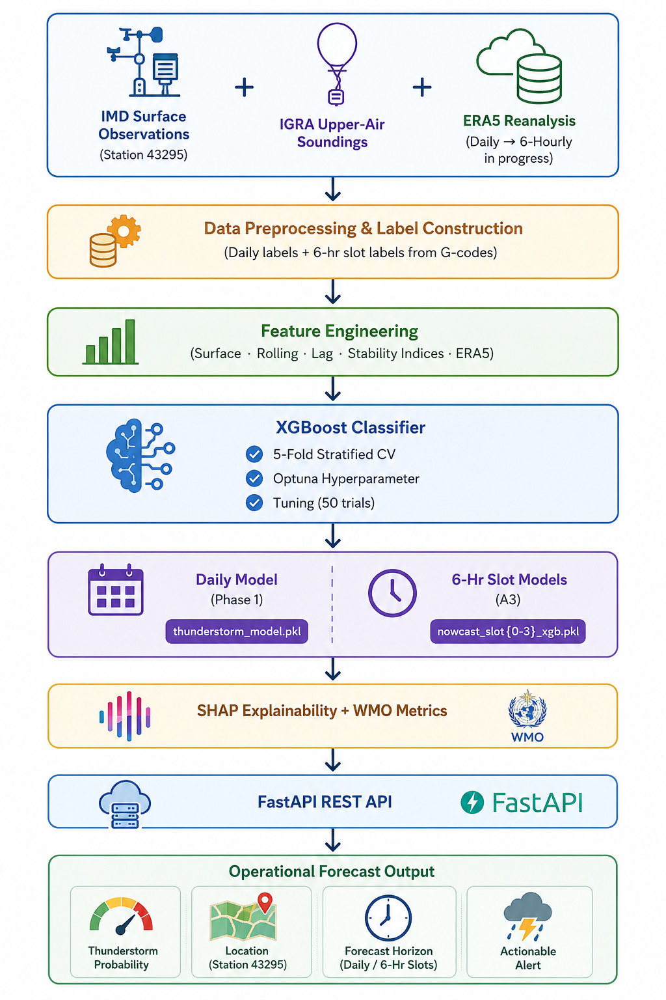

<div align="center">

# ⛈️ CSIR Thunderstorm Prediction System

### AI-Based Operational Thunderstorm Forecasting for Bengaluru Airport (IMD Station 43295)

Machine learning framework for predicting thunderstorm occurrence using **surface meteorological observations**, **upper-air stability indices**, **ERA5 reanalysis (6-hourly)**, and **explainable AI** — with a fully operational **6-hour nowcasting system**.

<p>
  
  
  
  
  
  
</p>

</div>

---

## Overview

The **CSIR Thunderstorm Prediction System** is an operational machine learning framework developed to forecast thunderstorm occurrence over **Kempegowda International Airport, Bengaluru (IMD Station 43295)**, in collaboration with **IMD Bengaluru (Dr. Geeta Agnihotri, Scientist F)**.

The system operates in two modes:

| Mode | Description | Status |
|------|-------------|:------:|
| **Daily Model** | Predicts whether a thunderstorm will occur on a given day | ✅ Complete |
| **6-Hour Nowcast** | Predicts thunderstorm probability for each 6-hour window | ✅ Operational |

---

## System Architecture


---

## 6-Hour Slot Definition

Labels derived from IMD Table-II weather type codes (T=9 = Thunderstorm) and G-codes (time of commencement):

| Slot | IST Window | ERA5 Snapshot | GFS Cycle | Base Rate | Operational Status |
|------|-----------|---------------|-----------|-----------|-------------------|
| 0 | 0001–0600 | 00Z UTC | prev-day 06Z f012 | 3.7% | Monitoring |
| 1 | 0601–1200 | 06Z UTC | prev-day 12Z f012 | 1.1% | Monitoring |
| **2** | **1201–1800** | **12Z UTC** | **prev-day 18Z f012** | **6.3%** | **Operational ✅** |
| 3 | 1801–2400 | 18Z UTC | same-day 00Z f012 | 5.9% | Monitoring |

---

## Feature Engineering

| Category | Features | Count |
|----------|----------|------:|
| Surface Variables | MAX, MIN, DTR, AW, RF, EVP, DRNRF, SSH | 8 |
| Rolling Statistics | RF_3d, RF_7d, MAX_3d_avg, MIN_3d_avg, DTR_3d_avg | 5 |
| Lag Features | RF_lag1, MAX_lag1, MIN_lag1, LABEL_lag1 | 4 |
| Seasonal Encodings | MONTH_sin, MONTH_cos, DOY_sin, DOY_cos, SEASON | 5 |
| Weather Flags | HA_flag, RF_nonzero | 2 |
| Upper-Air Stability | CAPE, K_INDEX, LIFTED_INDEX, TOTALS_TOTALS, PRECIP_WATER | 5 |
| ERA5 Surface (6-hrly) | T2M, D2M, U10, V10, CAPE, SP | 6 |
| ERA5 Pressure Levels (6-hrly) | T/q/u/v at 500, 700, 850 hPa | 12 |
| Slot Encodings | slot_sin, slot_cos, slot_month_clim, doy_sin, doy_cos | 5 |
| Slot Lag Features | ts_label_lag1_slot, ts_any_yesterday | 2 |
| **Total** | | **54** |

---

## Model Performance

### Daily Model (Phase 1)

| Model | AUROC | POD | FAR | CSI | HSS |
|-------|------:|----:|----:|----:|----:|
| Logistic Regression | 0.818 | — | — | — | — |
| Random Forest | 0.842 | — | — | — | — |
| LightGBM | 0.799 | — | — | — | — |
| XGBoost (surface only) | 0.809 | 0.510 | 0.742 | 0.207 | 0.247 |
| **XGBoost (surface + upper-air + ERA5)** | **0.871** | **0.500** | **0.586** | **0.293** | **0.389** |

### 6-Hour Nowcast — v1 vs v2

| Slot | Window | v1 AUROC | v2 AUROC | v2 POD | v2 FAR | v2 CSI | v2 HSS | Threshold |
|------|--------|:--------:|:--------:|-------:|-------:|-------:|-------:|:---------:|
| 0 | 0001–0600 | 0.9205 | 0.9016 | 0.200 | 0.950 | 0.042 | 0.065 | 0.29 |
| 1 | 0601–1200 | 0.8637 | 0.9108 | 0.000 | 1.000 | 0.000 | — | 0.41 |
| **2** | **1201–1800** | **0.8333** | **0.8212** | **0.356** | **0.623** | **0.224** | **0.318** | **0.34** |
| 3 | 1801–2400 | 0.8166 | 0.8415 | 0.286 | 0.926 | 0.063 | 0.087 | 0.60 |
| **Weighted** | | 0.8390 | **0.8352** | **0.318** | **0.724** | **0.169** | **0.240** | |

> **Key finding from v1 → v2:** With 6-hourly ERA5, `ERA5_CAPE` jumped from rank 42 → rank 2 for Slot 3 (evening). The model can now distinguish afternoon (12Z) from evening (18Z) atmospheric states, improving Slot 3 AUROC by +0.025. Slot 2 (1201–1800 IST) is the operationally ready window — HSS 0.318 with AUROC 0.821.

---

## SHAP Feature Importance (v2 Models)

| Slot | #1 | #2 | #3 | #4 | #5 |
|------|----|----|----|----|-----|
| 0 (Night) | CAPE | LABEL_lag1 | LIFTED_INDEX | DRNRF | MIN_3d_avg |
| 1 (Morning) | ts_any_yesterday | CAPE | RF | ERA5_q_700hPa | DRNRF |
| **2 (Afternoon)** | **CAPE** | **TOTALS_TOTALS** | **K_INDEX** | **ERA5_T2M** | **MIN** |
| 3 (Evening) | K_INDEX | ERA5_CAPE ↑ | LIFTED_INDEX | CAPE | ERA5_T2M ↑ |

↑ = significant rank improvement vs v1 model

---

## Real-Time Pipeline

Based on GFS 0.25° operational forecasts from NOAA NOMADS (t+12 approach, per Atul's pipeline scoping):

| UTC Cron | Script | Feeds |
|----------|--------|-------|
| 10:15 UTC | `fetch_gfs_realtime.py` + `fetch_upperair_realtime.py` | Slot 0 |
| 16:15 UTC | same | Slot 1 |
| 22:15 UTC | same | Slot 2 |
| 04:15 UTC | same | Slot 3 |

GFS posts ~3.5–4h after cycle time. t+12 approach gives ~6.5h buffer before each slot. IGRA radiosonde data used for training only (not real-time — daily batch product).

---

## Repository Structure

```text
CSIR_Thunderstorm/
│
├── data/
│   ├── bengaluru_thunderstorm_features_merged.csv     # daily features (54 cols)
│   ├── bengaluru_6hr_labels.csv                       # 6-hr slot labels (15,276 rows)
│   ├── bengaluru_6hr_training_dataset.csv             # v1 training dataset
│   ├── bengaluru_6hr_training_dataset_v2.csv          # v2 training dataset (6-hr ERA5)
│   ├── era5_6hrly_bengaluru_2015_2025.csv             # ERA5 6-hourly (Vidhi)
│   └── gfs_realtime/                                  # GFS real-time CSVs
│
├── models/
│   ├── thunderstorm_model.pkl                         # daily XGBoost model
│   ├── nowcast_6hr_xgb_v1.pkl                        # combined 6-hr model
│   ├── nowcast_slot{0-3}_xgb.pkl                     # v1 slot models (daily ERA5)
│   └── nowcast_slot{0-3}_xgb_v2.pkl                  # v2 slot models (6-hr ERA5) ← active
│
├── results/
│   ├── evaluation_results.csv                         # daily model metrics
│   ├── evaluation_results_per_slot.csv                # v1 slot metrics
│   ├── evaluation_results_per_slot_v2.csv             # v2 slot metrics
│   ├── shap_per_slot_importance.csv                   # v1 SHAP
│   ├── shap_per_slot_importance_v2.csv                # v2 SHAP
│   ├── shap_figures/                                  # v1 SHAP charts
│   ├── shap_figures_v2/                               # v2 SHAP charts
│   └── eda_figures/                                   # EDA charts (Sneha)
│
├── A1_feature_engineering.py      # builds 6-hr training dataset
├── A2_train_model.py              # trains combined 6-hr XGBoost
├── A3_slot_models.py              # trains v1 slot models (daily ERA5)
├── A4_shap_analysis.py            # SHAP on v1 models
├── A4_shap_analysis_v2.py         # SHAP on v2 models
├── A5_retrain_with_6hr_era5.py    # trains v2 slot models (6-hr ERA5)
├── fetch_gfs_realtime.py          # GFS real-time data fetcher
├── fetch_upperair_realtime.py     # upper-air stability indices from GFS (Atul)
├── predict_nowcast.py             # 6-hr nowcast prediction script
├── main.py                        # FastAPI application
├── API_EXAMPLES.md                # curl examples for all endpoints
├── baseline_model.py
├── tune_model.py
├── evaluate.py
├── predict.py
└── README.md
```

---

## Installation

```bash
git clone https://github.com/Aprameya05/CSIR-Thunderstorm-Bengaluru.git
cd CSIR-Thunderstorm-Bengaluru
pip install xgboost optuna scikit-learn joblib shap pandas numpy fastapi uvicorn cfgrib eccodes xarray requests metpy
```

---

## Usage

### Run 6-hour nowcast (demo)
```bash
python predict_nowcast.py
```

### Run for a specific date
```bash
python predict_nowcast.py --date 2023-10-11
```

### Start the API
```bash
uvicorn main:app --reload
```
Swagger UI: `http://127.0.0.1:8000/docs`

### Fetch real-time GFS data
```bash
python fetch_gfs_realtime.py --slot 2
python fetch_upperair_realtime.py --slot 2
```

---

## REST API Endpoints

| Method | Endpoint | Description |
|--------|----------|-------------|
| GET | `/` | Health check — model versions and thresholds |
| POST | `/predict` | Daily thunderstorm prediction |
| GET | `/nowcast/slots/info` | Slot metadata |
| POST | `/nowcast/predict/slot/{id}` | Single slot prediction (0–3) |
| POST | `/nowcast/predict/all` | All 4 slots in one call |

See `API_EXAMPLES.md` for curl examples.

---

## Development Roadmap

### Phase 1 — Daily Model ✅
- [x] Surface data preprocessing and feature engineering
- [x] Baseline ML models (LR, RF, LightGBM, XGBoost)
- [x] Hyperparameter optimisation (Optuna, 5-fold CV)
- [x] Upper-air stability indices (IGRA)
- [x] ERA5 daily feature integration
- [x] SHAP explainability
- [x] WMO verification metrics
- [x] FastAPI REST API

### Phase 2 — 6-Hour Nowcasting ✅
- [x] 6-hr label construction from IMD G-codes
- [x] 6-hr feature engineering pipeline (A1)
- [x] Combined 6-hr XGBoost model (A2)
- [x] Per-slot XGBoost models v1 — daily ERA5 (A3)
- [x] SHAP analysis v1 (A4)
- [x] ERA5 6-hourly data pull 2015–2025 (Vidhi)
- [x] Per-slot XGBoost models v2 — 6-hourly ERA5 (A5)
- [x] SHAP analysis v2 — ERA5_CAPE rank 42→2 for Slot 3 (A4 v2)
- [x] GFS real-time fetcher with t+12 cycle logic (Atul)
- [x] Upper-air stability indices from GFS via MetPy (Atul)
- [x] Prediction script with demo/date/live modes
- [x] FastAPI nowcast endpoints (Satvik)
- [x] EDA charts (Sneha)
- [x] API documentation and curl examples

### Phase 3 — Operations 📋
- [ ] Cron job deployment on server
- [ ] predict_nowcast.py --live-gfs mode
- [ ] Ceilometer integration
- [ ] LSTM temporal model
- [ ] Dashboard (Sneha)

---

## Team

| Member | Role | Contribution |
|--------|------|-------------|
| **Aprameya Bharadwaj** | ML Lead | A1–A5, SHAP, predict_nowcast.py, GFS fetcher, architecture |
| **Atul Denny** | Pipeline Lead | Pipeline scoping, GFS fetcher, upper-air stability indices via MetPy |
| **Satvik** | Deployment | FastAPI main.py, all 5 endpoints, input validation, API docs |
| **Vidhi** | ERA5 Data | 6-hourly ERA5 2015–2025 (16,072 rows, zero nulls) |
| **Sneha** | Visualization | 7 EDA charts — monthly heatmap, slot activity, yearly trends, CAPE, correlation |

---

## Acknowledgements

Developed under the guidance of **Dr. Geeta Agnihotri (Scientist F, IMD Bengaluru)** as part of a CSIR research initiative for operational thunderstorm prediction at Kempegowda International Airport.

---

## License

This repository is intended for academic and research purposes.
Copyright © 2026 CSIR Thunderstorm Prediction System. All rights reserved.