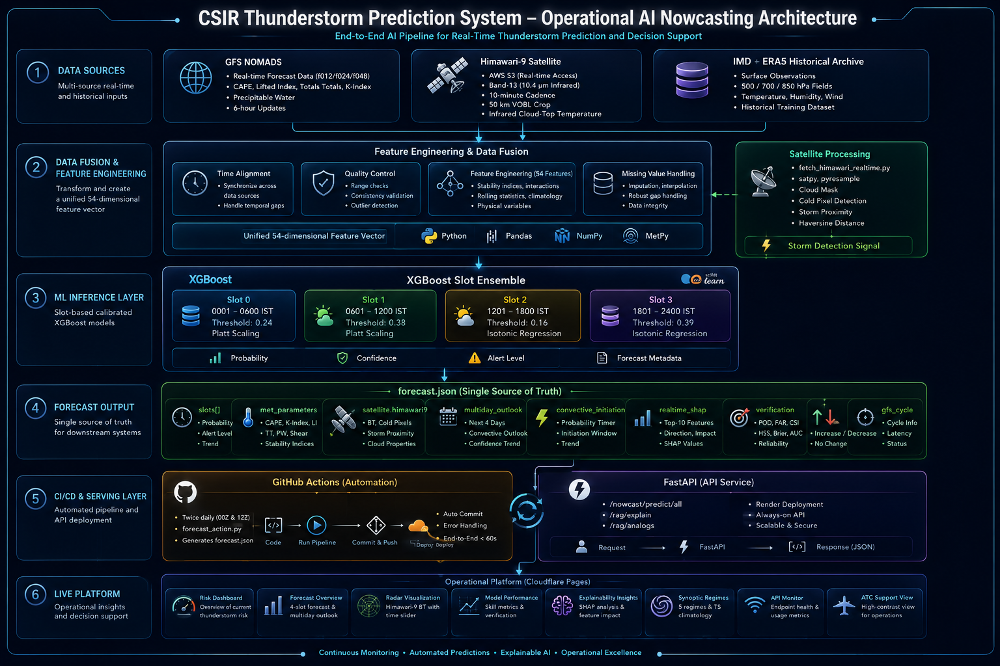

<div align="center">


# ⛈️ CSIR Thunderstorm Prediction System

### AI-Powered Operational Thunderstorm Nowcasting for Bengaluru Airport
#### IMD Station 43295 — Kempegowda International Airport (VOBL)

*Developed in collaboration with Dr. Geeta Agnihotri, Scientist F, IMD Bengaluru*

<p>
  
  
  
  
  
  
  
  
  
</p>

---

### 🌐 [Live Dashboard](https://csir-thunderstorm-bengaluru.pages.dev) &nbsp;|&nbsp; 🔗 [Live API](https://csir-thunderstorm-api.onrender.com) &nbsp;|&nbsp; 📖 [API Docs](https://csir-thunderstorm-api.onrender.com/docs)

</div>

---

## What This System Does

The CSIR Thunderstorm Prediction System is a fully operational AI nowcasting platform that predicts thunderstorm probability over Bengaluru Airport across four 6-hour windows every day. It ingests real-time atmospheric data from multiple sources — GFS NOMADS, Himawari-9 satellite, and upper-air soundings — runs calibrated XGBoost models, computes real-time SHAP explanations, generates physical explanations using Llama-3.3-70b, and serves everything through a live public dashboard with automatic CI/CD deployment. Twice daily, with zero human intervention.

---

## System Capabilities

### 🎯 6-Hour Nowcasting (4 Slots)
Four calibrated XGBoost v3 models output thunderstorm probabilities for:

| Slot | IST Window | Description | Threshold | Calibration |
|------|-----------|-------------|:---------:|:-----------:|
| 0 | 0001–0600 | Late Night | 0.24 | Platt Scaling |
| 1 | 0601–1200 | Morning | 0.38 | Platt Scaling |
| **2** | **1201–1800** | **Afternoon (peak)** | **0.16** | **Isotonic Regression** |
| 3 | 1801–2400 | Evening | 0.39 | Isotonic Regression |

Each model uses 54 features spanning surface observations, ERA5 6-hourly reanalysis at 500/700/850 hPa, upper-air stability indices, and 10 derived physical interaction terms.

### 📈 Trend Arrows
Every slot probability card shows a trend arrow (↑ ↓ →) and percentage change vs the previous forecast run. Rising probabilities are flagged in red, falling in green.

### ⚡ Convective Initiation Timer
A real-time instability score (0–100) computed from CAPE, K-Index, Lifted Index, and Totals-Totals. Shows hours to peak convective window (1300–1800 IST), current atmospheric state (PRE-CONVECTIVE / CONVECTIVE WINDOW ACTIVE / POST-CONVECTIVE), and risk level (MINIMAL / LOW / MODERATE / HIGH).

### 📅 Multi-Day Extended Outlook
GFS f024 and f048 forecasts provide tomorrow and day-after probabilistic outlooks — CAPE, K-Index, LI, Totals-Totals, and estimated Slot 2 TS probability for each future day.

### 🔴 Real-Time SHAP Explainability
`compute_realtime_shap.py` runs on every pipeline cycle, computing SHAP values using today's actual GFS inputs against each v3 slot model. The Explainability page shows which features are driving today's prediction — with direction (increases/decreases risk), magnitude, and actual input values. Switch between all 4 slots to see how SHAP profiles change.

### 🛰️ Himawari-9 Satellite BT Visualization
`fetch_himawari_realtime.py` pulls Band 13 (10.4 μm clean IR window) from NOAA AWS S3. The Radar Map page renders real cloud-top brightness temperatures as a color overlay:

| Color | BT Range | Meaning |
|-------|----------|---------|
| Dark | > −20°C | Clear sky |
| Green | −20 to −40°C | Cloud cover |
| Orange | −40 to −50°C | Deep convection |
| Red/Pink | < −50°C | Active storm cell |

Timeline scrubber shows up to 6 historical frames (1 hour of history at 10-min intervals).

### 🤖 RAG Explainability Engine (Llama-3.3-70b)
The `/rag/explain` endpoint accepts natural language questions and returns physical meteorological explanations grounded in today's real upper-air values. The `/rag/analogs` endpoint retrieves historically similar days from the 2015–2025 training record.

### 📊 Rolling Verification Dashboard
The Models page shows live 30-day rolling verification metrics (POD, FAR, HSS, Brier score) for Slot 2 computed from `verification_report.json`, alongside the full model architecture comparison (v1→v4) and calibration specifications.

### ⚙️ CI/CD Pipeline (GitHub Actions — 58 seconds end-to-end)
Two scheduled runs at **15:45 IST** and **21:45 IST**:

```
cron trigger
→ gfs_fetcher.py      (auto-discovers latest GFS cycle, fetches f012/f024/f048)
→ fetch_upperair_realtime.py  (MetPy stability indices)
→ forecast_action.py  (XGBoost inference + SHAP + convective timer + multiday)
→ compute_realtime_shap.py    (per-slot SHAP from today's inputs)
→ forecast.json committed to GitHub
→ Cloudflare Pages auto-deploy
→ Live website updated
```

### 🔌 Public REST API (FastAPI on Render)

| Method | Endpoint | Description |
|--------|----------|-------------|
| GET | `/` | Health check |
| POST | `/predict` | Daily thunderstorm prediction |
| GET | `/nowcast/slots/info` | Slot metadata |
| POST | `/nowcast/predict/slot/{id}` | Single slot prediction |
| POST | `/nowcast/predict/all` | All 4 slots |
| POST | `/rag/explain` | Llama-3.3-70b physical explanation |
| POST | `/rag/analogs` | Historical analog retrieval |

---

## System Architecture

<p align="center">
  
</p>
---

## Model Performance

### v3 Calibrated — Production Models

| Slot | AUROC | POD | FAR | CSI | HSS | Brier | Threshold |
|------|:-----:|----:|----:|----:|----:|------:|:---------:|
| 0 | 0.901 | 0.200 | 0.950 | 0.042 | 0.065 | — | 0.24 |
| 1 | 0.911 | 0.000 | 1.000 | 0.000 | — | — | 0.38 |
| **2** | **0.821** | **0.356** | **0.623** | **0.224** | **0.318** | **0.060** | **0.16** |
| 3 | 0.842 | 0.286 | 0.926 | 0.063 | 0.087 | — | 0.39 |

### Model Evolution

| Version | Key Change | Slot 2 AUROC |
|---------|-----------|:------------:|
| v1 | Daily ERA5 | 0.833 |
| v2 | 6-hourly ERA5 | 0.821 |
| **v3** | **Derived features + calibration** | **0.821** |
| v4 | Wind shear (research only) | 0.834 |

### Key Research Findings
- **ERA5_CAPE rank 42→2** for Slot 3 with 6-hourly ERA5 (v1→v2)
- **`cape_x_kindex`** interaction term entered top-5 SHAP in 3 of 4 slots (v3)
- **October accounts for 32%** of all Slot 2 misses — synoptically-forced convection with low CAPE
- **Slot 3 Brier score improved 64%** after isotonic calibration
- **R5 pre-monsoon convective burst:** 52.1% TS rate, lowest model AUROC (0.773)
- **LSTM/1D-CNN AUROC ~0.79** vs XGBoost 0.821 — dataset too small for deep learning

---

## SHAP Feature Importance (v3 Real-Time)

| Rank | Slot 0 (Night) | Slot 1 (Morning) | Slot 2 (Afternoon) | Slot 3 (Evening) |
|------|---------------|-----------------|-------------------|-----------------|
| 1 | ERA5_u_850hPa | DRNRF | K_INDEX | thetae_850 |
| 2 | LABEL_lag1 | CAPE | cape_x_kindex | ERA5_CAPE |
| 3 | LIFTED_INDEX | ERA5_q_700hPa | LIFTED_INDEX | K_INDEX |

*Values above are from today's real GFS inputs — updated every pipeline run.*

---

## Feature Engineering (54 Features)

| Category | Features | Count |
|----------|----------|------:|
| Surface Variables | MAX, MIN, DTR, AW, RF, EVP, DRNRF, SSH | 8 |
| Rolling Statistics | RF_3d, RF_7d, MAX/MIN/DTR_3d_avg | 5 |
| Lag Features | RF_lag1, MAX_lag1, MIN_lag1, LABEL_lag1 | 4 |
| Seasonal Encodings | MONTH_sin/cos, DOY_sin/cos, SEASON | 5 |
| Weather Flags | HA_flag, RF_nonzero | 2 |
| Upper-Air Stability | CAPE, CIN, K_INDEX, LIFTED_INDEX, TOTALS_TOTALS, PRECIP_WATER | 6 |
| ERA5 Surface (6-hrly) | T2M, D2M, U10, V10, CAPE, SP | 6 |
| ERA5 Pressure Levels | T, q, u, v at 500/700/850 hPa | 12 |
| Slot Encodings | slot_sin/cos, slot_month_clim, doy_sin/cos | 5 |
| Slot Lag | ts_label_lag1_slot, ts_any_yesterday | 2 |
| **Derived Interactions ★** | cape_x_kindex, li_x_totals, q_gradient_500_850, thetae_850, wind_shear_500_850, wind_shear_700_850, moisture_flux_850/700, thickness_500_850, mid_level_drying | **10** |

★ New in v3

---

## Data Sources

| Source | Data | Cadence | Script |
|--------|------|---------|--------|
| GFS NOMADS | CAPE, K-Index, LI, TT, ERA5 fields, f012/f024/f048 | 6-hourly | `gfs_fetcher.py` |
| Himawari-9 (NOAA S3) | Band 13 IR BT, 50km VOBL box | 10-min | `fetch_himawari_realtime.py` |
| IMD Table-II (43295) | Surface obs, TH flag, G-codes | Daily | Training + verification |
| ERA5 (CDS API) | 6-hourly T/q/u/v 500/700/850hPa | 6-hourly | Training (Vidhi) |
| IGRA Soundings | Upper-air profiles | Daily | Training only |
| MetPy (GFS-derived) | Stability indices all 4 slots | 6-hourly | `fetch_upperair_realtime.py` |

---

## Repository Structure

```
CSIR_Thunderstorm/
│
├── .github/workflows/
│   └── forecast_update.yml       # CI/CD: 2x daily, full pipeline + Cloudflare deploy
│
├── data/
│   ├── bengaluru_thunderstorm_features_merged.csv
│   ├── bengaluru_6hr_labels.csv
│   ├── era5_6hrly_bengaluru_2015_2025.csv        (Vidhi)
│   ├── upperair_realtime_43295.csv               (Atul)
│   ├── gfs_realtime_43295.csv                    (gfs_fetcher.py)
│   ├── gfs_multiday_43295.json                   (f024/f048 outlook)
│   ├── gfs_history_43295.json                    (last 6 cycles)
│   ├── himawari_realtime.json                    (Atul)
│   ├── himawari_history.json                     (last 6 frames)
│   ├── realtime_shap.json                        (today's SHAP values)
│   ├── forecast_log.csv                          (Sneha)
│   └── verification_today.json                   (Sneha)
│
├── models/
│   └── nowcast_slot{0-3}_xgb_v3_calibrated.pkl  ← PRODUCTION
│
├── results/
│   ├── evaluation_results_per_slot_v2.csv
│   ├── shap_per_slot_importance_v2.csv
│   └── verification_report.json                  (Sneha)
│
├── forecast_action.py            # GitHub Action pipeline script
├── gfs_fetcher.py                # Smart GFS fetcher (auto cycle discovery)
├── compute_realtime_shap.py      # Real-time SHAP from today's GFS inputs
├── forecast_json_exporter_v2.py  # Local forecast.json export
├── run_daily_forecast_v2.py      # Full local pipeline
├── fetch_gfs_realtime.py         # GFS slot fetcher (per-slot)
├── fetch_upperair_realtime.py    # MetPy stability indices (Atul)
├── fetch_himawari_realtime.py    # Himawari-9 satellite fetcher (Atul)
├── verify_today.py               # Daily verification (Sneha)
├── forecast_logger.py            # ForecastLogger class (Sneha)
├── main.py                       # FastAPI — 7 endpoints (Satvik)
├── index.html                    # React dashboard (single file)
├── forecast.json                 # Latest forecast — auto-updated 2x daily
└── README.md
```

---

## Installation

```bash
git clone https://github.com/Aprameya05/CSIR-Thunderstorm-Bengaluru.git
cd CSIR-Thunderstorm-Bengaluru
pip install xgboost scikit-learn joblib shap pandas numpy \
            fastapi uvicorn requests metpy boto3 satpy \
            pyresample pytz groq cfgrib eccodes xarray
```

---

## Usage

```bash
# Run 6-hour nowcast
python predict_nowcast.py
python predict_nowcast.py --date 2023-10-11

# Full daily pipeline
python run_daily_forecast_v2.py

# Smart GFS fetch (auto-discovers latest cycle + f024/f048)
python gfs_fetcher.py

# Compute real-time SHAP from today's GFS inputs
python compute_realtime_shap.py

# Export forecast.json with all signals
python forecast_action.py

# Fetch Himawari-9 satellite data
python fetch_himawari_realtime.py

# Start API locally
uvicorn main:app --reload
# → http://127.0.0.1:8000/docs

# Test RAG explanation
curl -X POST https://csir-thunderstorm-api.onrender.com/rag/explain \
  -H "Content-Type: application/json" \
  -d '{"query": "Why did Slot 2 fire today?", "date": "2026-07-26"}'
```

---

## Development Roadmap

### Phase 1 — Daily Model ✅
- [x] XGBoost with surface + upper-air + ERA5 (AUROC 0.871)
- [x] SHAP explainability, WMO verification metrics, FastAPI

### Phase 2 — 6-Hour Nowcasting ✅
- [x] Per-slot XGBoost v1→v3 with calibration
- [x] ERA5 6-hourly 2015–2025 (Vidhi)
- [x] GFS real-time + MetPy upper-air (Atul)
- [x] RAG endpoints (Groq Llama-3.3-70b)

### Phase 3 — Operations ✅
- [x] Live React dashboard — 8 pages (Cloudflare Pages)
- [x] GitHub Actions CI/CD — 58s end-to-end
- [x] FastAPI public deployment (Render)
- [x] Himawari-9 BT storm proximity fetcher (Atul)
- [x] Rolling verification dashboard (Sneha)

### Phase 3.5 — Intelligence Layer ✅
- [x] Smart GFS cycle auto-discovery
- [x] Trend arrows on slot cards
- [x] Convective initiation timer with instability score
- [x] Multi-day extended outlook (f024/f048)
- [x] Real-time SHAP per slot from today's GFS inputs
- [x] Himawari-9 BT visualization on Radar Map

### Phase 4 — Enhancements 📋
- [ ] Historical analog display on dashboard
- [ ] Synoptic regime auto-detection from GFS fields
- [ ] Airport impact score (flights affected estimate)
- [ ] GPM IMERG precipitation overlay
- [ ] IMD Doppler radar (pending Dr. Agnihotri)
- [ ] Model drift detection alert

---

## Team

| Member | Role | Key Contributions |
|--------|------|------------------|
| **Aprameya Bharadwaj** | ML Lead & Architect | A1–A5, pipeline, RAG, dashboard, CI/CD, GFS fetcher, SHAP, convective timer |
| **Atul Denny** | Data & Pipeline Lead | GFS fetcher, MetPy upper-air, Himawari-9 satellite fetcher |
| **Satvik** | Deployment Lead | FastAPI, Render deployment, all 7 API endpoints |
| **Vidhi** | ERA5 Data | 6-hourly ERA5 2015–2025 (16,072 rows, zero nulls) |
| **Sneha** | Verification | EDA, ForecastLogger, rolling verification dashboard |

---

## Acknowledgements

Developed under the guidance of **Dr. Geeta Agnihotri (Scientist F, IMD Bengaluru)** as part of a CSIR-backed research initiative for operational thunderstorm prediction at Kempegowda International Airport.

Data: IMD Table-II, ERA5 (Copernicus CDS), GFS (NOAA NOMADS), Himawari-9 (NOAA AWS S3), IGRA soundings.

---

<div align="center">

*For academic and research purposes only.*
*Copyright © 2026 CSIR Thunderstorm Prediction System. All rights reserved.*

</div>
