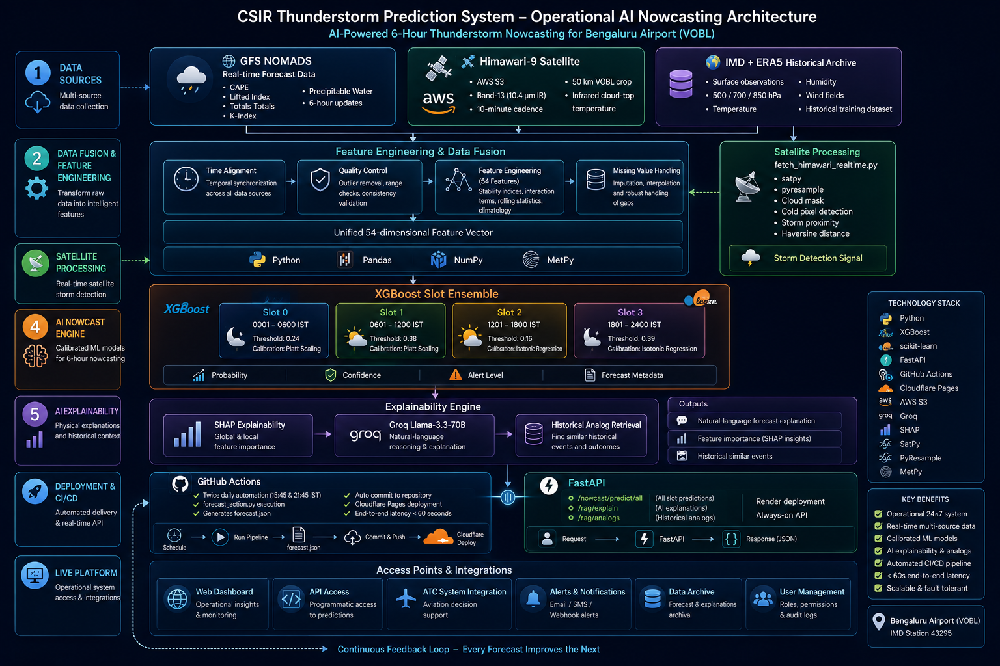

<div align="center">


# ⛈️ CSIR Thunderstorm Prediction System

### AI-Powered Operational Thunderstorm Nowcasting for Bengaluru Airport
#### IMD Station 43295 — Kempegowda International Airport (VOBL)

*Developed in collaboration with Dr. Geeta Agnihotri, Scientist F, IMD Bengaluru*

<p>
  
  
  
  
  
  
  
  
</p>

---

### 🌐 [Live Dashboard](https://csir-thunderstorm-bengaluru.pages.dev) &nbsp;|&nbsp; 🔗 [Live API](https://csir-thunderstorm-api.onrender.com) &nbsp;|&nbsp; 📖 [API Docs](https://csir-thunderstorm-api.onrender.com/docs)

</div>

---

## What This System Does

The CSIR Thunderstorm Prediction System is a fully operational AI nowcasting platform that predicts thunderstorm probability over Bengaluru Airport in six 6-hour windows every day. It ingests real-time atmospheric data from multiple sources, runs calibrated XGBoost models, generates physical explanations using a large language model, and serves everything through a live public dashboard — automatically, twice a day, with no human intervention.

This is not a research prototype. It is a production system with a live website, a public REST API, satellite storm detection, and automated CI/CD deployment.

---

## System Capabilities

### 🎯 6-Hour Nowcasting (4 Slots)
The core of the system. Four calibrated XGBoost models — one per 6-hour window — output thunderstorm probabilities for:

| Slot | IST Window | Description | Threshold | Calibration |
|------|-----------|-------------|:---------:|:-----------:|
| 0 | 0001–0600 | Late Night | 0.24 | Platt Scaling |
| 1 | 0601–1200 | Morning | 0.38 | Platt Scaling |
| **2** | **1201–1800** | **Afternoon (peak)** | **0.16** | **Isotonic Regression** |
| 3 | 1801–2400 | Evening | 0.39 | Isotonic Regression |

Each model uses 54 features spanning surface observations, ERA5 6-hourly reanalysis at 500/700/850 hPa, stability indices, derived physical interaction terms, and climatological slot encodings.

### 🛰️ Himawari-9 Satellite Storm Proximity
`fetch_himawari_realtime.py` pulls Band 13 (10.4 μm clean IR window) from the public NOAA AWS S3 bucket every 10 minutes. It crops to a 50 km bounding box around VOBL (13.1986°N, 77.7066°E) using segments S04+S05+S06, and computes:

- **Min brightness temperature** in the 50 km box (colder = deeper convection)
- **Cold pixel count** (pixels below −40°C threshold = active storm cells)
- **Distance to nearest cold pixel** from VOBL
- **Storm detected flag** (True/False)

This gives an independent satellite-based storm proximity signal that runs alongside the ML forecast, providing real observational corroboration.

### 🤖 RAG Explainability Engine (Llama-3.3-70b)
The `/rag/explain` endpoint accepts a natural language question about the forecast and returns a physical meteorological explanation generated by **Groq Llama-3.3-70b**, grounded in real-time atmospheric data:

```
User: "Why did Slot 2 fire today?"

RAG Engine: "The CSIR XGBoost model triggered Slot 2 primarily due to 
the moderate CAPE (195 J/kg) and favorable K-Index (40.31), indicating 
loaded moisture with potential for convective initiation. The cape_x_kindex 
interaction term — the top SHAP feature for this slot — reached a value 
consistent with afternoon convective development over the Bengaluru plateau..."
```

The engine pulls today's real upper-air values (CAPE, K-Index, LI, Totals-Totals, PW) into the prompt context, ensuring the explanation reflects actual atmospheric conditions rather than generic text.

A second endpoint `/rag/analogs` retrieves the most similar historical days from the 2015–2025 training record, ranked by atmospheric similarity to today's conditions.

### 📊 Live Dashboard
A single-file React application served from Cloudflare Pages with zero build step:

- **Dashboard** — convective risk gauge, 4-slot probability cards, risk probability bar, alert status, background image that changes by time of day (night/morning/afternoon/evening)
- **Forecast** — detailed 6-hour slot breakdown with circular arc gauges, decision limit indicators, 24-hour diurnal timeline
- **Radar Map** — storm proximity panel (satellite-based)
- **Models** — model skill verification metrics (AUROC, POD, FAR, CSI, HSS, Brier), v1/v2/v3/v4 architecture comparison, rolling verification by year
- **Explainability** — SHAP feature importance bar chart (per slot), AI RAG terminal with suggested queries
- **Regimes** — synoptic regime analysis (5 regimes, R5 pre-monsoon convective burst: 52.1% TS rate)
- **Live API** — interactive API explorer with endpoint list
- **ATC View** — high-contrast operational view for air traffic control

All panels read from `forecast.json` which is auto-updated twice daily.

### ⚙️ CI/CD Pipeline (GitHub Actions)
Two scheduled runs per day at **15:45 IST** and **21:45 IST**:

```
Trigger (cron) → Checkout repo → Install deps → Run forecast_action.py
→ Commit forecast.json → Deploy to Cloudflare Pages
```

Every push to `main` also triggers a Cloudflare Pages deploy automatically. The entire pipeline from data ingestion to live website update takes under 60 seconds.

### 🔌 Public REST API (FastAPI on Render)
Seven endpoints, fully documented at `/docs`:

| Method | Endpoint | Description |
|--------|----------|-------------|
| GET | `/` | Health check — loaded models, thresholds, versions |
| POST | `/predict` | Daily thunderstorm prediction |
| GET | `/nowcast/slots/info` | Slot metadata and windows |
| POST | `/nowcast/predict/slot/{id}` | Single slot prediction (0–3) |
| POST | `/nowcast/predict/all` | All 4 slots in one API call |
| POST | `/rag/explain` | LLM-powered physical forecast explanation |
| POST | `/rag/analogs` | Historical analog day retrieval |

CORS enabled for all origins. No authentication required. Free to use for research.

---

## 🏗️ System Architecture

The CSIR Thunderstorm Prediction System follows a production-grade end-to-end AI pipeline, integrating real-time numerical weather prediction, satellite observations, feature engineering, calibrated machine learning, explainable AI, and automated cloud deployment into a fully operational nowcasting platform.

<p align="center">
  
</p>

---

## Model Performance

### Daily Model (Phase 1 Baseline)

| Model | AUROC | POD | FAR | CSI | HSS |
|-------|------:|----:|----:|----:|----:|
| Logistic Regression | 0.818 | — | — | — | — |
| Random Forest | 0.842 | — | — | — | — |
| LightGBM | 0.799 | — | — | — | — |
| XGBoost (surface only) | 0.809 | 0.510 | 0.742 | 0.207 | 0.247 |
| **XGBoost + upper-air + ERA5** | **0.871** | **0.500** | **0.586** | **0.293** | **0.389** |

### 6-Hour Nowcast Model Evolution

| Version | Key Change | Slot 2 AUROC | Slot 3 AUROC |
|---------|-----------|:------------:|:------------:|
| v1 | Daily ERA5 | 0.833 | 0.817 |
| v2 | 6-hourly ERA5 | 0.821 | 0.842 |
| **v3** | **Derived features + calibration** | **0.821** | **0.842** |
| v4 | Wind shear (research only) | 0.834 | — |

> **v3 is production.** v4 wind shear features used single-point 200hPa winds — spatial divergence gradients require neighbouring grid points and did not improve performance.

### v3 Calibrated — Full Metrics

| Slot | AUROC | POD | FAR | CSI | HSS | Brier |
|------|:-----:|----:|----:|----:|----:|------:|
| 0 | 0.901 | 0.200 | 0.950 | 0.042 | 0.065 | — |
| 1 | 0.911 | 0.000 | 1.000 | 0.000 | — | — |
| **2** | **0.821** | **0.356** | **0.623** | **0.224** | **0.318** | **0.060** |
| 3 | 0.842 | 0.286 | 0.926 | 0.063 | 0.087 | — |

### Key Research Findings

- **ERA5_CAPE rank 42→2** for Slot 3 with 6-hourly ERA5 (v1→v2) — the model can now distinguish afternoon (12Z) from evening (18Z) atmospheric states
- **`cape_x_kindex` interaction term** entered top 5 SHAP features in 3 of 4 slots as a v3 derived feature
- **October accounts for 32%** of all Slot 2 misses due to synoptically-forced convection (low CAPE median 186 J/kg vs 538 J/kg for hits)
- **Slot 3 Brier score improved 64%** after isotonic calibration
- **LSTM and 1D-CNN** both achieved AUROC ~0.79 vs XGBoost 0.821 — dataset too small for deep learning (~2800 sequences)
- **R5 pre-monsoon convective burst** regime: 52.1% TS rate but lowest model AUROC (0.773) — synoptically-forced events remain the hardest to predict

---

## SHAP Feature Importance (v3)

| Rank | Slot 0 (Night) | Slot 1 (Morning) | Slot 2 (Afternoon) | Slot 3 (Evening) |
|------|---------------|-----------------|-------------------|-----------------|
| 1 | CAPE | ts_any_yesterday | **cape_x_kindex** ★ | **cape_x_kindex** ★ |
| 2 | LABEL_lag1 | CAPE | CAPE | ERA5_CAPE ↑ |
| 3 | LIFTED_INDEX | RF | TOTALS_TOTALS | K_INDEX |
| 4 | DRNRF | ERA5_q_700hPa | K_INDEX | LIFTED_INDEX |
| 5 | MIN_3d_avg | DRNRF | ERA5_T2M | thetae_850 ★ |

★ = new v3 derived physical interaction feature &nbsp; ↑ = significant rank improvement vs v1

---

## Feature Engineering (54 Features)

| Category | Features | Count |
|----------|----------|------:|
| Surface Variables | MAX, MIN, DTR, AW, RF, EVP, DRNRF, SSH | 8 |
| Rolling Statistics | RF_3d, RF_7d, MAX/MIN/DTR_3d_avg | 5 |
| Lag Features | RF_lag1, MAX_lag1, MIN_lag1, LABEL_lag1 | 4 |
| Seasonal Encodings | MONTH_sin/cos, DOY_sin/cos, SEASON | 5 |
| Weather Flags | HA_flag, RF_nonzero | 2 |
| Upper-Air Stability | CAPE, CIN, K_INDEX, LIFTED_INDEX, TOTALS_TOTALS, PRECIP_WATER | 6 |
| ERA5 Surface (6-hrly) | T2M, D2M, U10, V10, CAPE, SP | 6 |
| ERA5 Pressure Levels | T, q, u, v at 500/700/850 hPa | 12 |
| Slot Encodings | slot_sin/cos, slot_month_clim, doy_sin/cos | 5 |
| Slot Lag | ts_label_lag1_slot, ts_any_yesterday | 2 |
| **Derived Interactions** ★ | cape_x_kindex, li_x_totals, q_gradient_500_850, thetae_850, wind_shear_500_850, wind_shear_700_850, moisture_flux_850/700, thickness_500_850, mid_level_drying | **10** |
| **Total** | | **54** |

★ = new in v3

---

## CI/CD Pipeline

The system uses **GitHub Actions** for fully automated continuous integration and deployment:

```yaml
Trigger: cron '15 10,16 * * *'  (15:45 IST + 21:45 IST daily)
         + on every push to main

Steps:
  1. Checkout repository
  2. Set up Python 3.11
  3. Install dependencies (pandas, numpy, xgboost, joblib, scikit-learn)
  4. Run forecast_action.py → generates forecast.json
  5. Commit and push forecast.json to main
  6. Deploy to Cloudflare Pages via wrangler-action
```

**End-to-end latency: ~58 seconds** from trigger to live website update.

Secrets managed via GitHub repository secrets:
- `CLOUDFLARE_API_TOKEN` — Cloudflare Pages deploy permission
- `CLOUDFLARE_ACCOUNT_ID` — target account
- `GITHUB_TOKEN` — auto-provided for repo commits

---

## Data Sources

| Source | Data | Cadence | Used For |
|--------|------|---------|---------|
| IMD Table-II (Station 43295) | Surface obs, TH flag, T/G codes | Daily | Training labels, verification |
| ERA5 (CDS API) | 6-hourly T/q/u/v at 500/700/850hPa, CAPE, SP | 6-hourly | Training features (Vidhi) |
| GFS NOMADS | CAPE, K-Index, LI, Totals, PW | 6-hourly | Real-time inference (Atul) |
| IGRA Soundings | Upper-air profiles | Daily | Training only |
| Himawari-9 (NOAA S3) | Band 13 IR brightness temperature | 10-min | Storm proximity signal (Atul) |
| MetPy (GFS-derived) | Stability indices | 6-hourly | Real-time upper-air (Atul) |

---

## Repository Structure

```
CSIR_Thunderstorm/
│
├── .github/workflows/
│   └── forecast_update.yml          # CI/CD: 2x daily forecast + Cloudflare deploy
│
├── data/
│   ├── bengaluru_thunderstorm_features_merged.csv   # 54-feature daily dataset
│   ├── bengaluru_6hr_labels.csv                     # slot labels from IMD G-codes
│   ├── bengaluru_6hr_training_dataset_v2.csv        # v3 training set (6-hr ERA5)
│   ├── era5_6hrly_bengaluru_2015_2025.csv           # ERA5 6-hourly (Vidhi)
│   ├── upperair_realtime_43295.csv                  # real-time upper-air (Atul)
│   ├── himawari_realtime.json                       # latest satellite signal (Atul)
│   ├── himawari_history.json                        # 6-frame rolling history (Atul)
│   ├── forecast_log.csv                             # rolling forecast log (Sneha)
│   └── verification_today.json                     # daily verification (Sneha)
│
├── models/
│   ├── thunderstorm_model.pkl                       # daily XGBoost
│   └── nowcast_slot{0-3}_xgb_v3_calibrated.pkl     # ← PRODUCTION models
│
├── results/
│   ├── evaluation_results_per_slot_v2.csv          # v3 metrics
│   ├── shap_per_slot_importance_v2.csv             # v3 SHAP
│   └── verification_report.json                    # rolling verification (Sneha)
│
├── A1_feature_engineering.py        # 6-hr dataset construction
├── A2_train_model.py                # combined 6-hr XGBoost
├── A3_slot_models.py                # v1 per-slot models
├── A4_shap_analysis_v2.py           # v3 SHAP analysis
├── A5_retrain_with_6hr_era5.py      # v2/v3 training
│
├── forecast_action.py               # GitHub Action inference script
├── forecast_json_exporter_v2.py     # local forecast.json export with met params
├── run_daily_forecast_v2.py         # full operational pipeline (local)
├── predict_nowcast.py               # standalone prediction script
├── verify_today.py                  # daily verification logger (Sneha)
├── forecast_logger.py               # ForecastLogger class (Sneha)
│
├── fetch_gfs_realtime.py            # GFS real-time fetcher
├── fetch_upperair_realtime.py       # upper-air stability via MetPy (Atul)
├── fetch_himawari_realtime.py       # Himawari-9 satellite fetcher (Atul)
│
├── main.py                          # FastAPI app — 7 endpoints (Satvik)
├── index.html                       # React dashboard (single file, no build)
├── forecast.json                    # latest forecast — auto-updated by CI/CD
├── netlify.toml                     # bandwidth optimisation config
└── README.md
```

---

## Installation

```bash
git clone https://github.com/Aprameya05/CSIR-Thunderstorm-Bengaluru.git
cd CSIR-Thunderstorm-Bengaluru

pip install xgboost scikit-learn joblib shap pandas numpy \
            fastapi uvicorn requests metpy boto3 satpy \
            pyresample pytz groq
```

---

## Usage

```bash
# Run 6-hour nowcast (demo mode)
python predict_nowcast.py

# Run for a specific historical date
python predict_nowcast.py --date 2023-10-11

# Run full daily pipeline (with GFS fetch)
python run_daily_forecast_v2.py

# Run pipeline without fetching new data
python run_daily_forecast_v2.py --skip-fetch

# Export forecast.json with real met parameters
python forecast_json_exporter_v2.py

# Fetch Himawari-9 satellite storm proximity signal
python fetch_himawari_realtime.py

# Run verification for yesterday's forecast
python verify_today.py

# Start the API locally
uvicorn main:app --reload
# → Swagger UI: http://127.0.0.1:8000/docs

# Test the RAG explanation endpoint
curl -X POST https://csir-thunderstorm-api.onrender.com/rag/explain \
  -H "Content-Type: application/json" \
  -d '{"query": "Why did Slot 2 fire today?", "date": "2026-07-25"}'
```

---

## Development Roadmap

### Phase 1 — Daily Model ✅
- [x] Surface + upper-air + ERA5 XGBoost (AUROC 0.871)
- [x] Hyperparameter optimisation (Optuna)
- [x] SHAP explainability
- [x] WMO verification metrics (POD, FAR, CSI, HSS)
- [x] FastAPI REST API

### Phase 2 — 6-Hour Nowcasting ✅
- [x] Label construction from IMD G-codes (T=9, G-code → 6-hr slot)
- [x] Per-slot XGBoost v1 → v2 → v3 with calibration
- [x] ERA5 6-hourly 2015–2025 (Vidhi)
- [x] GFS real-time fetcher with t+12 cycle logic (Atul)
- [x] Upper-air stability indices via MetPy (Atul)
- [x] 10 derived physical interaction features (v3)
- [x] Probability calibration — Isotonic (Slots 2,3) + Platt (Slots 0,1)
- [x] RAG endpoints — Groq Llama-3.3-70b explanation engine
- [x] Historical analog retrieval

### Phase 3 — Operations ✅
- [x] Live React dashboard — 8 pages, real data (Cloudflare Pages)
- [x] GitHub Actions CI/CD — 2x daily, end-to-end < 60s
- [x] FastAPI public deployment (Render)
- [x] RAG chatbox connected to live endpoint
- [x] Himawari-9 Band 13 storm proximity fetcher (Atul)
- [x] Real met parameters wired into dashboard
- [x] Rolling verification dashboard (Sneha)
- [x] Bandwidth-optimised hosting (migrated Netlify → Cloudflare Pages)

### Phase 4 — Enhancements 📋
- [ ] `gfs_fetcher.py` — all 4 slots with real-time CAPE/K-Index
- [ ] Himawari storm signal panel on Radar Map page
- [ ] Daily automated verification in GitHub Action
- [ ] LSTM / temporal model (research)
- [ ] IMD Doppler radar integration (pending Dr. Agnihotri — VOBL DWR not yet public)
- [ ] Damini lightning network integration (pending IMD access)

---

## Team

| Member | Role | Key Contributions |
|--------|------|------------------|
| **Aprameya Bharadwaj** | ML Lead & Architect | A1–A5, SHAP, pipeline, RAG system, React dashboard, CI/CD, overall architecture |
| **Atul Denny** | Data & Pipeline Lead | GFS fetcher, upper-air MetPy stability indices, Himawari-9 satellite fetcher |
| **Satvik** | Deployment Lead | FastAPI main.py, Render deployment, all 7 API endpoints, API documentation |
| **Vidhi** | ERA5 Data | 6-hourly ERA5 2015–2025 (16,072 rows, zero nulls), 200/300hPa wind data |
| **Sneha** | Verification & Visualization | 9 EDA charts, ForecastLogger, rolling verification dashboard, forecast JSON exporter |

---

## Acknowledgements

Developed under the guidance of **Dr. Geeta Agnihotri (Scientist F, IMD Bengaluru)** as part of a CSIR-backed research initiative for operational thunderstorm prediction at Kempegowda International Airport, Bengaluru.

Data sources: IMD Table-II observations, ERA5 (Copernicus CDS), GFS (NOAA NOMADS), Himawari-9 (NOAA AWS S3), IGRA upper-air soundings.

---

<div align="center">

*For academic and research purposes only.*
*Copyright © 2026 CSIR Thunderstorm Prediction System. All rights reserved.*

</div>
